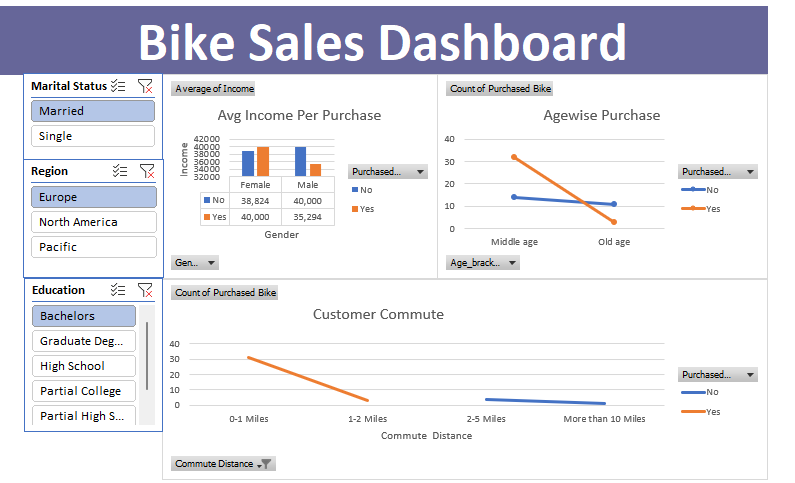

# Bike Buyers Analysis - Excel Dashboard
### 📌 Project Overview
This project analyzes a dataset of bike buyers to identify purchasing patterns based on demographics, income, and lifestyle factors. The goal is to demonstrate data analysis skills in Microsoft Excel, including Pivot Tables, Charts, Conditional Formatting, and Dashboard Design.

## 📊 Dataset Description
**Source:** Provided Excel dataset  
**Data Includes:**
- Customer Demographics (Age, Gender, Region, Income)
- Lifestyle Factors (Commute Distance, Home Ownership, Cars Owned)
- Purchase Decision (Whether they bought a bike)

## 🛠 Excel Techniques Used
- **Data Cleaning:** Removing duplicates, handling missing values
- **Pivot Tables:** Summarizing data dynamically
- **Charts & Graphs:** Visualizing trends (Bar Chart, Pie Chart, Line Graph)
- **Conditional Formatting:** Highlighting insights with color-coded values
- **Dashboard Design:** Interactive layout for clear insights

## 📸 Dashboard Preview

## 📥 How to Access the Excel File
1. Download the `bike_dashboard.xlsx` file from this repository.
2. Open it in Microsoft Excel 2016 or later.
3. Navigate through different sheets for raw data, pivot tables, and dashboard insights.

